## 使用Azure容器服务（AKS）快速搭建你的AI解决方案
<!-- TOC -->

- [使用Azure容器服务（AKS）快速搭建你的AI解决方案](#使用azure容器服务aks快速搭建你的ai解决方案)
    - [概述](#概述)
        - [关于微软AI平台](#关于微软ai平台)
    - [实验环境准备](#实验环境准备)
        - [操作系统](#操作系统)
        - [安装 java](#安装-java)
        - [安装 maven](#安装-maven)
        - [安装 az cli](#安装-az-cli)
        - [安装 kubectl](#安装-kubectl)
        - [安装 docker](#安装-docker)
        - [安装 docker-compose](#安装-docker-compose)
        - [安装 unzip](#安装-unzip)
    - [练习一：使用Azure 自定义视觉服务（Custom Vision Service）](#练习一使用azure-自定义视觉服务custom-vision-service)
        - [1、上传图片集](#1上传图片集)
        - [2、训练和测试](#2训练和测试)
        - [3、模型下载和部署](#3模型下载和部署)
    - [练习二：前端应用程序准备](#练习二前端应用程序准备)
    - [练习三：创建Azure Container Registry](#练习三创建azure-container-registry)
        - [1、配置Azure命令行](#1配置azure命令行)
        - [2、创建Azure Container Registry](#2创建azure-container-registry)
        - [3、将镜像打标签推送到镜像仓库](#3将镜像打标签推送到镜像仓库)
    - [练习四：创建Kubernetes Cluster](#练习四创建kubernetes-cluster)
        - [配置ACR认证](#配置acr认证)
    - [练习五：部署和运行AI应用](#练习五部署和运行ai应用)
    - [练习六：Scale AI应用](#练习六scale-ai应用)
        - [1、Scale AKS Nodes](#1scale-aks-nodes)
        - [2、手动Scale pods](#2手动scale-pods)
        - [3、Autoscale pods](#3autoscale-pods)
    - [总结](#总结)
    - [参考资料](#参考资料)

<!-- /TOC -->
### 概述
In this handson lab you will first use Microsoft Custom Vision Service to train an image classification model and deploy it with a web application on Azure Container Service(AKS). You will also learn how to scale the application using AKS. 

在本动手实验中，你将使用微软自定义视觉服务来训练图像分类模型，并将此模型和另一个Java web应用程序一起部署在Azure容器服务（AKS）环境中（系统架构示意图如下）。同时，你将学习如何使用AKS来扩展应用。

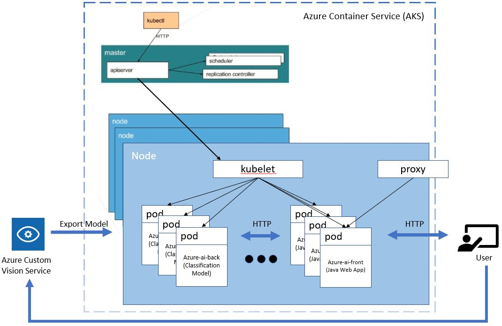

#### 关于微软AI平台

微软的AI平台基于Azure云环境，综合了当前最先进的技术，包括机器学习、深度学习等，为开发者和数据科学家提供了一个灵活的AI平台。本实验所使用的Azure 自定义视觉服务（Custom Vision Service）即属于“认知服务（Cognitive Service）”的一部分。


### 实验环境准备

本实验的开发者环境使用了Azure VM。用户也可以按照以下步骤自己搭建开发环境：
#### 操作系统
Ubuntu Server 16.04 LTS or later
#### 安装 java
```
sudo apt-get install software-properties-common
sudo add-apt-repository ppa:webupd8team/java
sudo apt-get update
sudo apt-get install oracle-java8-installer
```
#### 安装 maven
```
sudo apt install maven
```
#### 安装 az cli
```
AZ_REPO=$(lsb_release -cs)
echo "deb [arch=amd64] https://packages.microsoft.com/repos/azure-cli/ $AZ_REPO main" | sudo tee /etc/apt/sources.list.d/azure-cli.list

curl -L https://packages.microsoft.com/keys/microsoft.asc | sudo apt-key add -

sudo apt-get install apt-transport-https
sudo apt-get update
sudo apt-get install azure-cli
```
#### 安装 kubectl
```
sudo apt-get install -y apt-transport-https
curl -s https://packages.cloud.google.com/apt/doc/apt-key.gpg | sudo apt-key add -

sudo touch /etc/apt/sources.list.d/kubernetes.list 

echo "deb http://apt.kubernetes.io/ kubernetes-xenial main" | sudo tee -a /etc/apt/sources.list.d/kubernetes.list

sudo apt-get update

sudo apt-get install -y kubectl
```
#### 安装 docker
```
sudo apt install docker.io
```
#### 安装 docker-compose
```
sudo curl -L https://github.com/docker/compose/releases/download/1.21.2/docker-compose-$(uname -s)-$(uname -m) -o /usr/local/bin/docker-compose

sudo chmod +x /usr/local/bin/docker-compose
```
#### 安装 unzip
```
sudo apt install unzip
```
### 练习一：使用Azure 自定义视觉服务（Custom Vision Service）

Azure提供了自定义图像识别训练服务，用户可以上传自己的图片数据集，完成打标签、训练和发布模型的过程，而不需要关注底层的算法和训练机制。

#### 1、上传图片集
repo里面包含图片压缩包Animals.zip，存储到本机，解压并查看图片内容，本次使用的是动物图片库，包括羊和狼两种动物。

使用提供的Azure账号登录[Custom Vision](https://www.customvision.ai/)，创建新的项目，进行动物种类识别。项目配置选择Classification和General(Compact)。


项目创建成功后，点击Add images上传图片。


上传图片时，将图片库中train文件夹中的图片做为训练数据上传，每次上传一个文件夹内的图片，并标记为对应的标签。例如，将图片库中train文件夹中的sheep文件夹中的图片做为训练数据上传，并标记为sheep标签。狼的图片同理。

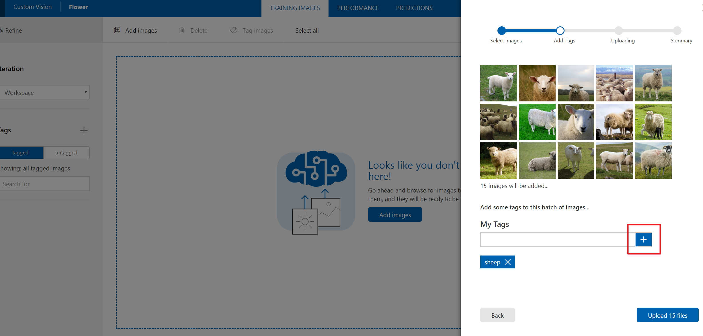

训练图片上传完成后，会在portal上展示图片和tag。

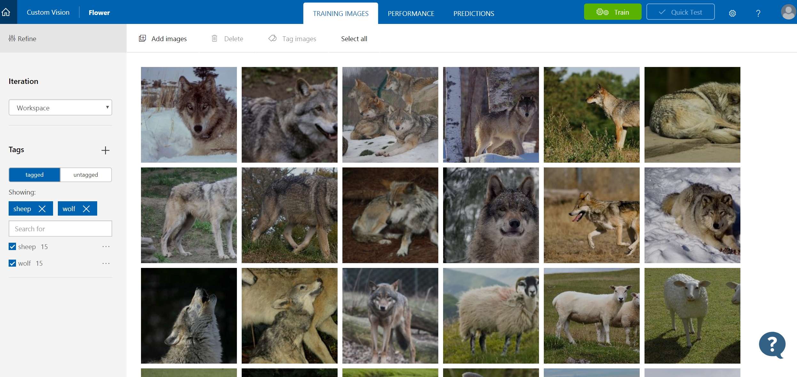

#### 2、训练和测试

点击训练按钮开始训练该图片分类应用。


训练完成后可以看到这一轮迭代的结果，包括精度(precision)和回调率(recall)，将该轮训练结果设置为默认的训练模型。

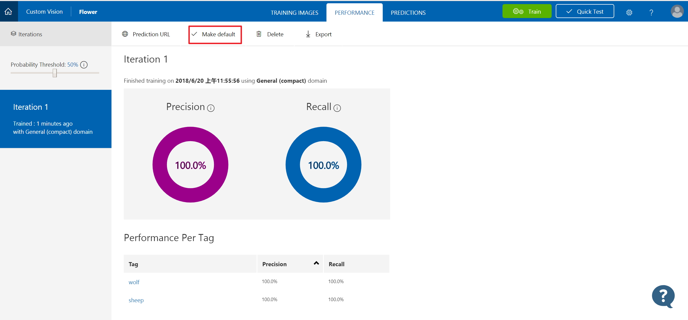

点击prediction URL可以看到对外发布的模型API。点击quick test可以在线测试模型的效果，例如选择test文件夹中的sheep或者wolf文件夹中的图片，上传测试。


#### 3、模型下载和部署

点击export按钮可以下载训练好的模型，可以选择Core ML，Tensorflow for Android, ONNX以及Docker形式。在这次实验中我们下载docker形式的模型，选择Linux容器，就可以获得Docker File的下载地址(右键选择download获得下载地址)。

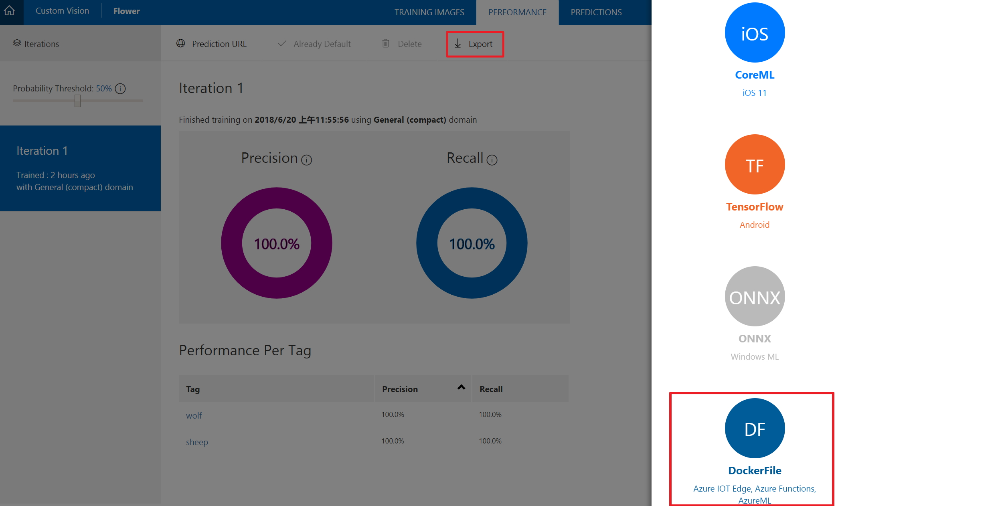

获得下载地址后，需要把Dockerfile下载到Azure中预装好的VM中。首先登录http://ms.portal.azure.com，选择“仪表板”找到预装好的VM，如图所示，获得VM的IP地址。打开电脑中的Putty工具，通过该IP地址连接到已经配置好的VM。登陆用户和密码可以在说明文件中找到。

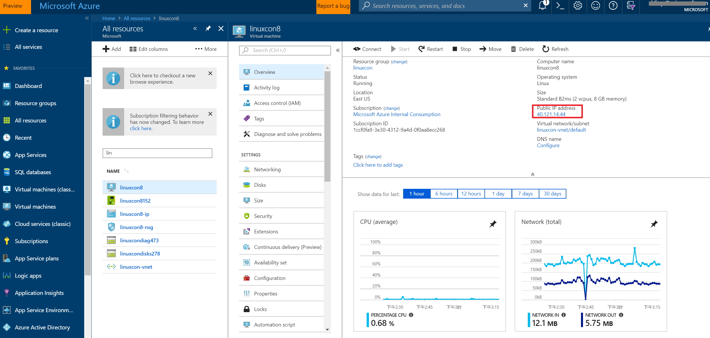

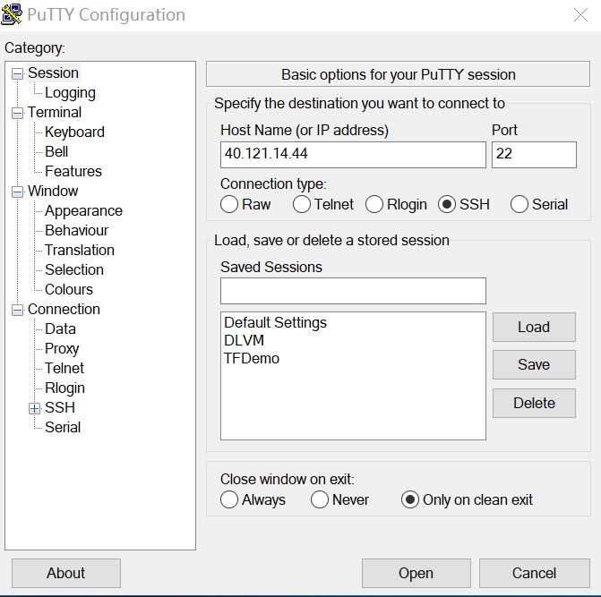

登录Linux虚拟机后，输入如下命令，用来下载模型和创建docker image，并且看到完成的名为model-img的docker image。

``` Linux command
wget "<custom vision model download url>" -k -O cv.zip
```
你也可以在这里下载我们做好的模型：http://aka.ms/linuxcon8-model
执行以下命令，完成模型创建。
```
unzip cv.zip -d cv
mv DockerFile Dockerfile
sudo docker build -t model-img .
```
查看映像的生成情况：
```
lincon@linuxcon8:~$ sudo docker images
REPOSITORY                          TAG                 IMAGE ID            CREATED             SIZE
model-img                           latest              df7246f8785b        11 minutes ago      1.33 GB
...
```

启动该Docker image, 并进行测试，传入图片url返回测试结果。
``` Linux command
sudo docker run -p 80:80 -d model-img
curl -X POST http://127.0.0.1:80/url -d "{ \"url\": \"https://icdn2.digitaltrends.com/image/chimera-majestic-sheep-tongue.jpg\" }"
```
你将得到类似的结果：
```
{
  "created": "2018-06-21T15:42:48.185278",
  "id": "",
  "iteration": "",
  "predictions": [
    {
      "boundingBox": null,
      "probability": 0.999999463558197,
      "tagId": "",
      "tagName": "sheep"
    }
  ],
  "project": ""
}
```
至此我们已经完成了动物图像分类模型的训练和导出。此模型的映像，model-img将作为AI应用程序中的后端应用：azure-ai-back.

### 练习二：前端应用程序准备

首先，获得AI前端应用azure-ai-front的代码：
```
git clone https://github.com/MS-CSE-GCR/Linuxcon2018.git
```
运行以下命令，完成编译和打包。
```
cd Linuxcon2018
mvn package
```
azure-ai-front是基于Spring Boot创建的Java web应用。打包成功以后，创建映像。
```
sudo docker build -t app-img .
```
运行以下命令，查看生成的映像。
```
lincon@linuxcon8:~$ sudo docker images
REPOSITORY                          TAG                 IMAGE ID            CREATED             SIZE
app-img                             latest              4a9249287efb        16 hours ago        661 MB
```

### 练习三：创建Azure Container Registry

Azure Container Registry(ACR)是Azure提供的Docker Registry，基于开源的Docker Registry 2.0，用于存储和管理用户的私有Docker容器镜像，AKS可以从该镜像仓库将镜像部署到容器集群中。

#### 1、配置Azure命令行

创建和管理ACR需要使用Azure命令行，虚拟机里面已经安装好Azure CLI，首先需要登录完成用户配置。
``` Azure cli
az login
```
输入命令后，会出现登录链接和登录授权码，在网页中输入登录授权码，并输入Azure用户名和密码完成登录。
```
lincon@linuxcon8:~$ az login
To sign in, use a web browser to open the page https://microsoft.com/devicelogin and enter the code AP3JJGVSK to authenticate.
```
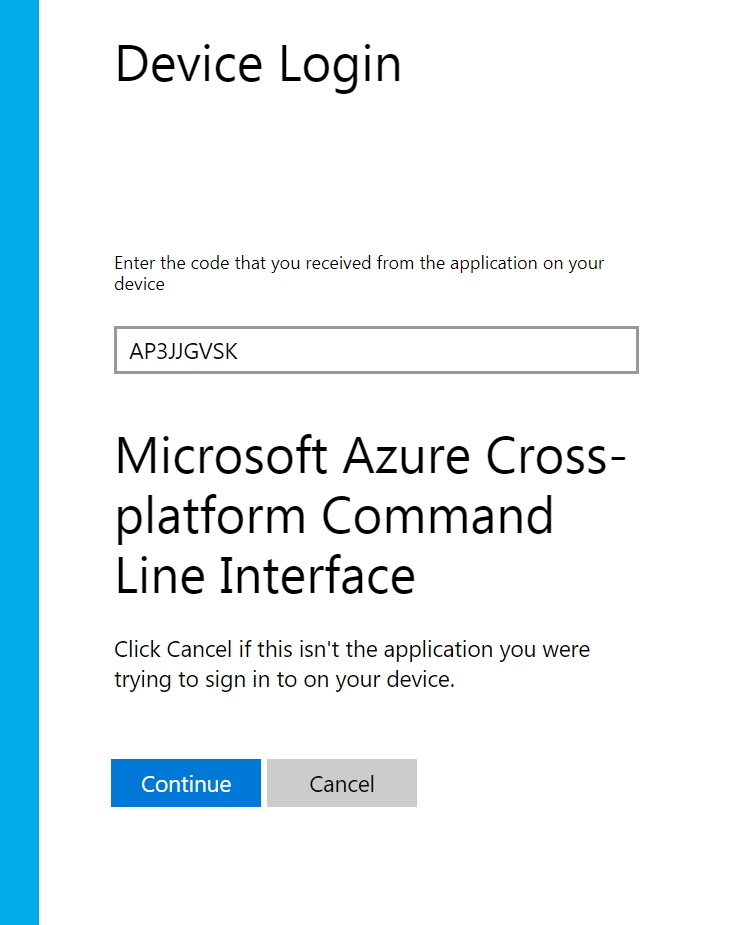

#### 2、创建Azure Container Registry

首先获取虚拟机所在的资源组（Resource Group）名称。如果需要，登录http://ms.portal.azure.com，在Resource Group所显示的即为资源组名称，该ACR将要创建在这个资源组里面。


创建ACR。将下面命令中的<ResourceGroupName>替换成你的资源组名称，<RegistryName>替换成你要创建的ACR名称。
```Azure CLI
az acr create -g <ResourceGroupName> -n <RegistryName> --sku Basic
```


登录ACR
```Azure CLI
sudo az acr login --name <RegistryName>
```
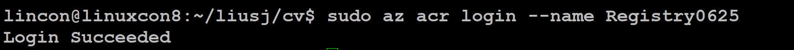


显示loginserver

```Azure CLI
az acr show --name <RegistryName> --query loginServer
```
确认loginServer的格式为<RegistryName>.azurecr.io

#### 3、将镜像打标签推送到镜像仓库

```Azure CLI
sudo docker tag app-img <RegistryName>.azurecr.io/app-img:v1
sudo docker push <RegistryName>.azurecr.io/app-img:v1

sudo docker tag model-img <RegistryName>.azurecr.io/model-img:v1
sudo docker push <RegistryName>.azurecr.io/model-img:v1
```


如果出现authentication required导致的推送失败，可以再次运行下面命令，以确保ACR登录成功，然后再重新推送。
```Azure CLI
sudo az acr login --name <RegistryName>
```

返回ACR的结果

```Azure CLI
az acr repository list --name <RegistryName> --output table
```
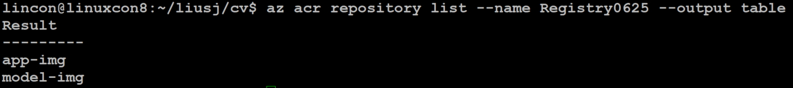

```Azure CLI
az acr repository show-tags --name <RegistryName> --repository model-img --output table
```


至此，前一部分实验生成的应用和模型镜像都完成了到Azure Container Registry的上传。

### 练习四：创建Kubernetes Cluster
运行以下命令创建Kubernetes Cluster。本操作会运行几分钟后完成。
```
az aks create --resource-group <ResourceGroupName> --name <ClusterName> --node-count 1 --generate-ssh-keys --location eastus
```
为了使用client访问Kubernetes Cluster，需要安装AKS CLI，请运行以下命令：
```
sudo az aks install-cli
```

使用kubectl命令连接Kubernetes Cluster
```
az aks get-credentials --resource-group <ResourceGroupName> --name <ClusterName>
```
执行以下命令，确认已经连接到Kubernetes Cluster
```
lincon@linuxcon8:~$ kubectl get nodes
NAME                       STATUS    ROLES     AGE       VERSION
aks-nodepool1-15518157-0   Ready     agent     1d        v1.9.6
```
#### 配置ACR认证
我们需要在AKS cluster和ARC registry之间配置认证机制，从而使得AKS identity能够有权限从ACR registry中pull images. 
第一步，取得为AKS配置的service principal ID。
```
az aks show --resource-group <ResourceGroupName> --name <ClusterName> --query "servicePrincipalProfile.clientId" --output tsv
```
第二步，取得ACR registry resource id
```
az acr show --name <RegistryName> --resource-group <ResourceGroupName> --query "id" --output tsv
```
最后，创建role assignment，以取得相应权限。
```
az role assignment create --assignee <clientID> --role Reader --scope <acrID>
```

### 练习五：部署和运行AI应用
更新manifest文件：azure-ai.yaml（你可以在git clone https://github.com/MS-CSE-GCR/Linuxcon2018.git 所获得的文件夹Linuxcon2018中找到）。
Azure Container Registry (ACR) 用来存储容器的映像。在运行应用之前，我们需要使用ACR login server名称来更新Kubernetes manifest文件，及本实验的azure-ai.yaml文件。
```
az acr list --resource-group <ResourceGroupName> --query "[].{acrLoginServer:loginServer}" --output table
```

按照以下方式更新azure-ai.yaml
```
 ...
 containers:
      - name: azure-ai-back
        image: <RegistryName>.azurecr.io/model-img:v1
 ...
 containers:
      - name: azure-ai-front
        image: <RegistryName>.azurecr.io/app-img:v1
...
```
运行以下命令部署应用：
```
kubectl apply -f azure-ai.yaml
```
结果显示如下：
```
deployment "azure-ai-back" created
service "azure-ai-back" created
deployment "azure-ai-front" created
service "azure-ai-front" created
```
测试AI应用
Kubernetes Service将应用暴露在internet上的过程需要几分钟时间。我们可以使用以下命令来监控进程：
```
lincon@linuxcon8:~$ kubectl get service azure-ai-front --watch
NAME             TYPE           CLUSTER-IP     EXTERNAL-IP      PORT(S)          AGE
azure-ai-front   LoadBalancer   10.0.243.231   40.114.107.184   8080:30848/TCP   1d
```

获得EXTERNAL-IP以后，在浏览器中输入以下内容访问AI应用：
http://EXTERNAL-IP:8080
你应该看到如下的页面：

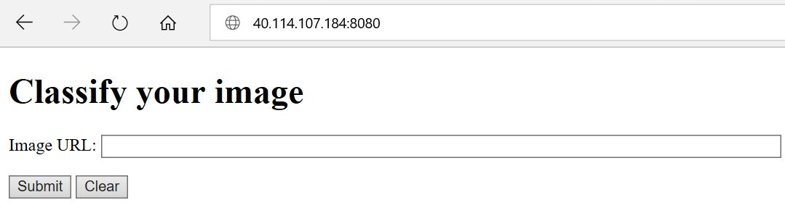

在Image URL中输入以下图片链接，并按Submit进行测试：
```
http://www.parishplan.uk/wp-content/uploads/2015/05/Sheep-300.jpg
http://cf.ltkcdn.net/kids/images/slide/91879-445x400-animalfact8.jpg
```
结果会有类似的页面显示：


你也可以使用在线的其他图片来测试图像分类的准确度。这里的azure-ai-front接收了你的请求，将图片输入到azure-ai-back进行图像分类，后者再将分类结果以JSON的格式返回给azure-ai-front。

### 练习六：Scale AI应用
此前我们已经完成了AI应用在AKS上的部署和运行工作，下面我们来看看如何将此应用进行scale。

#### 1、Scale AKS Nodes
此前我们创建的Kubernetes Cluster只有一个node。为了让我们的AI应用能够处理更多的工作负载，我们可以手动地调整node的数目。

下面我们将node数目增加到3个，整个操作需要耗时几分钟。
```
az aks scale --resource-group=<ResourceGroupName> --name=<ClusterName> --node-count 3
```
使用以下命令查看node数目：
```
lincon@linuxcon8:~$ kubectl get nodes
NAME                       STATUS    ROLES     AGE       VERSION
aks-nodepool1-15518157-0   Ready     agent     1d        v1.9.6
aks-nodepool1-15518157-1   Ready     agent     6h        v1.9.6
aks-nodepool1-15518157-2   Ready     agent     6h        v1.9.6
```
#### 2、手动Scale pods
此前我们部署的azure-ai-front和azure-ai-back的每个实例，都是有一个replica。运行以下命令查看：
```
lincon@linuxcon8:~$ kubectl get pods
NAME                              READY     STATUS    RESTARTS   AGE
azure-ai-back-559b7cc9b4-566p2    1/1       Running   0          1d
azure-ai-front-565b88ccd8-45h4j   1/1       Running   0          6h
```
下面我们手动地将replica的数量增加到5个：
```
kubectl scale --replicas=5 deployment/azure-ai-front
```
运行以下命令查看结果：
```
lincon@linuxcon8:~$ kubectl get pods
NAME                              READY     STATUS    RESTARTS   AGE
azure-ai-back-559b7cc9b4-566p2    1/1       Running   0          1d
azure-ai-front-565b88ccd8-45h4j   1/1       Running   0          6h
azure-ai-front-565b88ccd8-hc74s   1/1       Running   0          6h
azure-ai-front-565b88ccd8-mrh6c   1/1       Running   0          6h
azure-ai-front-565b88ccd8-x575h   1/1       Running   0          6h
azure-ai-front-565b88ccd8-zlhzr   1/1       Running   0          16h
```
#### 3、Autoscale pods
Kubernetes支持horizontal pod autoscaling，可以根据CPU使用率以及其他标准来调整pod数量。
要使用autoscaler, 我们必须定义CPU requests和limits. 如在 azure-ai-front deployment中我们定义了container requests 0.25 CPU, limit为0.5 CPU. 如下所示:
```
resources:
  requests:
     cpu: 250m
  limits:
     cpu: 500m
```
下面我们使用kubectl autoscale命令来autoscale pod的数量：如果CPU使用率超过50%, autoscaler将增加pod数量达到10.
```
kubectl autoscale deployment azure-ai-front --cpu-percent=50 --min=3 --max=10
```
使用以下命令检查autoscaler的状态：
```
lincon@linuxcon8:~$ kubectl get hpa
NAME             REFERENCE                   TARGETS         MINPODS   MAXPODS   REPLICAS   AGE
azure-ai-front   Deployment/azure-ai-front   <unknown>/50%   3         10        5          6h
```
### 总结
恭喜！你已经完成了本实验的所有内容！在本动手实验中，你学会了使用微软自定义视觉服务来训练图像分类模型，并将此模型和另一个web应用程序一起部署在Azure容器服务（AKS）环境中。同时，你学会了如何使用AKS来扩展应用。

### 参考资料
* [Azure Container Service(AKS)](https://docs.microsoft.com/en-us/azure/aks/)
* [Microsoft Azure AI](http://www.azure.com/ai)