## Quickly build your AI solution with Azure Container Service(AKS)
<!-- TOC -->

- [Quickly build your AI solution with Azure Container Service(AKS)](#quickly-build-your-ai-solution-with-azure-container-serviceaks)
    - [Overview](#overview)
        - [Microsoft AI Platform](#microsoft-ai-platform)
    - [Environment Setup](#environment-setup)
        - [OS](#os)
        - [install java](#install-java)
        - [install maven](#install-maven)
        - [install az cli](#install-az-cli)
        - [install kubectl](#install-kubectl)
        - [install docker](#install-docker)
        - [install compose](#install-compose)
        - [install unzip](#install-unzip)
    - [Exercise 1：Custom Vision Service](#exercise-1custom-vision-service)
        - [1. Upload image dataset](#1-upload-image-dataset)
        - [2. train and test](#2-train-and-test)
        - [3、model download and deployment](#3model-download-and-deployment)
    - [Exercise 2：Front end application](#exercise-2front-end-application)
    - [Exercise 3：Create Azure Container Registry](#exercise-3create-azure-container-registry)
        - [1、Config Azure Commandline](#1config-azure-commandline)
        - [2、创建Azure Container Registry](#2创建azure-container-registry)
        - [3. tag the image and push it to registry](#3-tag-the-image-and-push-it-to-registry)
    - [Exercise 4：Create Kubernetes Cluster](#exercise-4create-kubernetes-cluster)
        - [Config ACR authentication](#config-acr-authentication)
    - [Exercise 5：Deploy and manage AKS cluster](#exercise-5deploy-and-manage-aks-cluster)
    - [Exercise 6：Scale AI application](#exercise-6scale-ai-application)
        - [1、Scale AKS Nodes](#1scale-aks-nodes)
        - [2、Manually scale pods](#2manually-scale-pods)
        - [3、Autoscale pods](#3autoscale-pods)
    - [Summary](#summary)
    - [Reference](#reference)

<!-- /TOC -->
### Overview
In this handson lab you will first use Microsoft Custom Vision Service to train an image classification model and deploy it with a web application on Azure Container Service(AKS). You will also learn how to scale the application using AKS. 

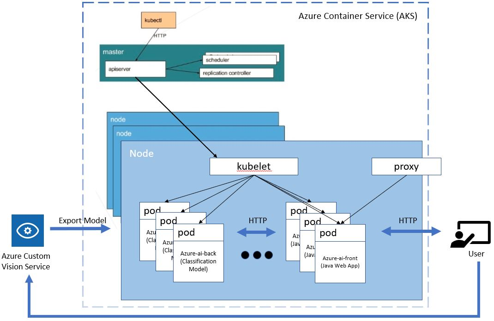

#### Microsoft AI Platform

Microsoft is making AI approachable and productive for all developers and data scientists with its flexible AI platform, combining the latest advances in technologies like machine learning and deep learning, with our comprehensive data, Azure cloud and productivity platform. Azure Custom Vision Service, which we are going to use in this lab, is in under the category of Cognitive Service.

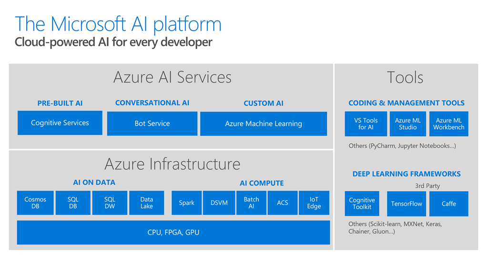

### Environment Setup

This environment leverages Azure VM, users can set up their own environment based on below steps:

#### OS
Ubuntu Server 16.04 LTS or later

#### install java
```
sudo apt-get install software-properties-common
sudo add-apt-repository ppa:webupd8team/java
sudo apt-get update
sudo apt-get install oracle-java8-installer
```
#### install maven
```
sudo apt install maven
```
#### install az cli
```
AZ_REPO=$(lsb_release -cs)
echo "deb [arch=amd64] https://packages.microsoft.com/repos/azure-cli/ $AZ_REPO main" | sudo tee /etc/apt/sources.list.d/azure-cli.list

curl -L https://packages.microsoft.com/keys/microsoft.asc | sudo apt-key add -

sudo apt-get install apt-transport-https
sudo apt-get update
sudo apt-get install azure-cli
```
#### install kubectl
```
sudo apt-get install -y apt-transport-https
curl -s https://packages.cloud.google.com/apt/doc/apt-key.gpg | sudo apt-key add -

sudo touch /etc/apt/sources.list.d/kubernetes.list 

echo "deb http://apt.kubernetes.io/ kubernetes-xenial main" | sudo tee -a /etc/apt/sources.list.d/kubernetes.list

sudo apt-get update

sudo apt-get install -y kubectl
```
#### install docker
```
sudo apt install docker.io
```
#### install compose
```
sudo curl -L https://github.com/docker/compose/releases/download/1.21.2/docker-compose-$(uname -s)-$(uname -m) -o /usr/local/bin/docker-compose

sudo chmod +x /usr/local/bin/docker-compose
```
#### install unzip
```
sudo apt install unzip
```
### Exercise 1：Custom Vision Service

Azure provides custom vision service, which user can upload his own image dataset, and tag images, train and deploy model, with no need to pay attention to how the model is like and how to train the model。

#### 1. Upload image dataset
Download the dataset Animals.zip from the repo to local machine,unzip the package. This image dataset is an animal dataset, including the animal of sheep and wolf.

Use Azure account to login [Custom Vision](https://www.customvision.ai/)，create a new project for animal image classfication. Note that configuration should be Classification和General(Compact).

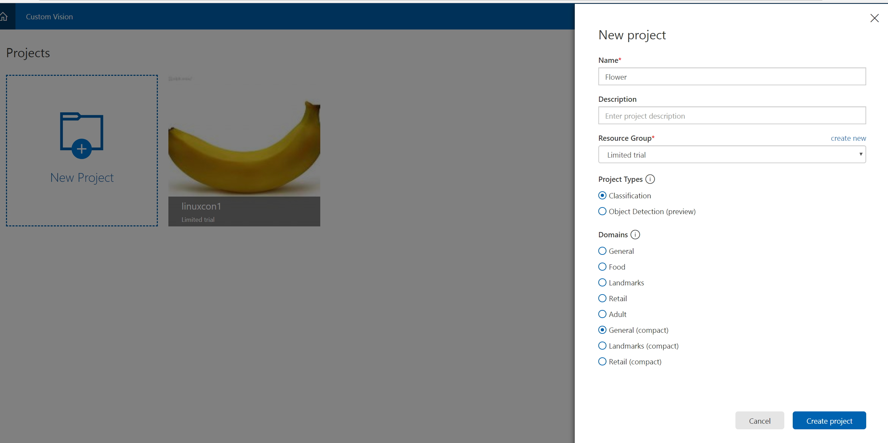

After creating the project, add "Add images" to upload images.

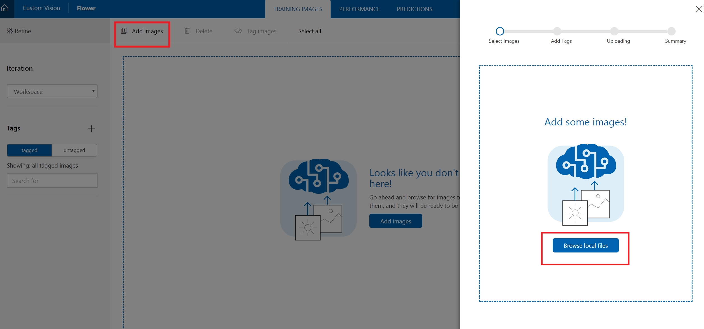

When uploading the images, upload the images in the "train" folder as training data, and tag it. For example, upload the sheep images in the training folder and tag it as sheep. So as the wolf.

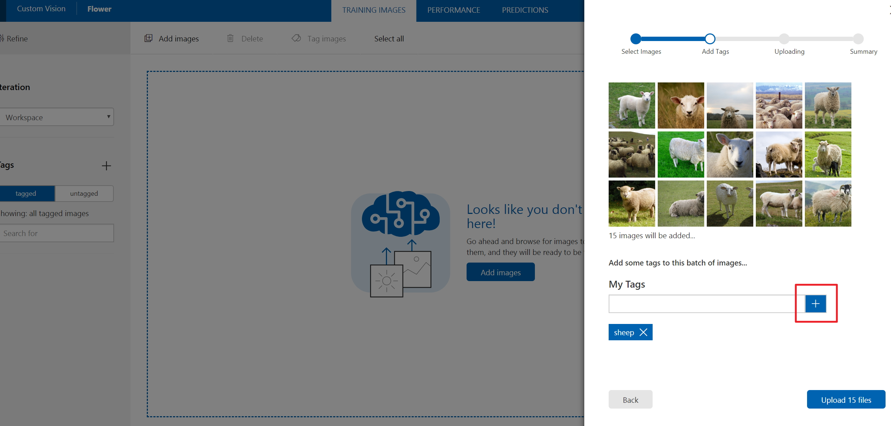

After uploading, the images and tags will be shown in the portal.

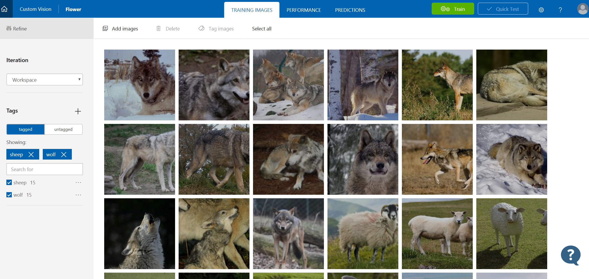

#### 2. train and test

Click train button to train the classification model.

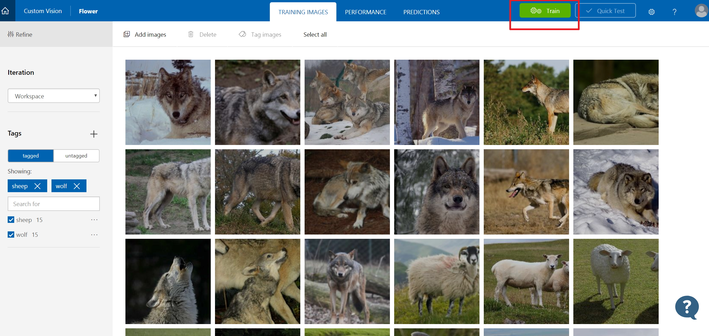

After training, you can get the result of this training iteration, including precision and recal, set this iteration as the default model.

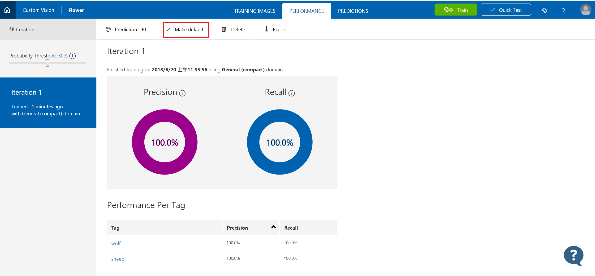

Click prediction URL to check the deployed model API, click "quick test" to test the model online.

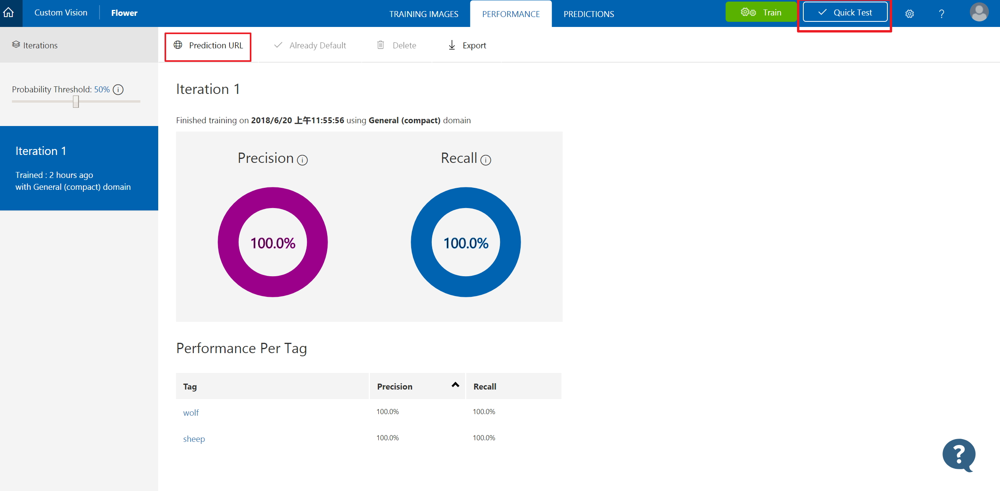

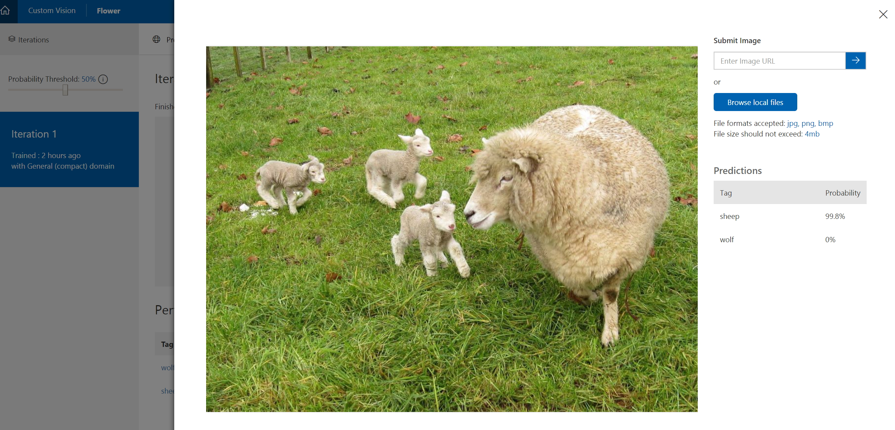

#### 3、model download and deployment

Click "export" button to download the trained well model, including Core ML, Tensorflow for Android, ONNX and Docker format. In this HOL, we download docker model in Linux container, and get the download url of Docker File. (Click right on the download button to get the download url).

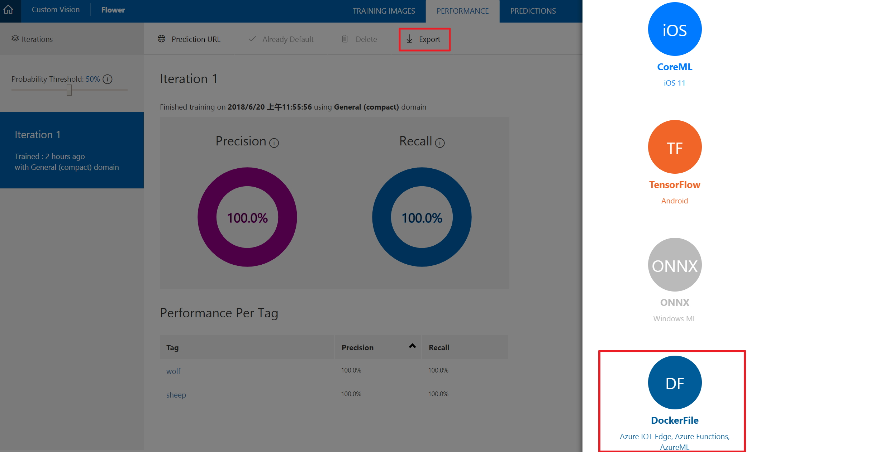

With the download url, download the Dockerfile to the VM in Azure we provide. First login http://ms.portal.azure.com, find the pre-installed VM in the Azure portal, get the IP of the VM, and use Putty to connect to this VM. The login username is lincon, password is LinuxCon2018=1.

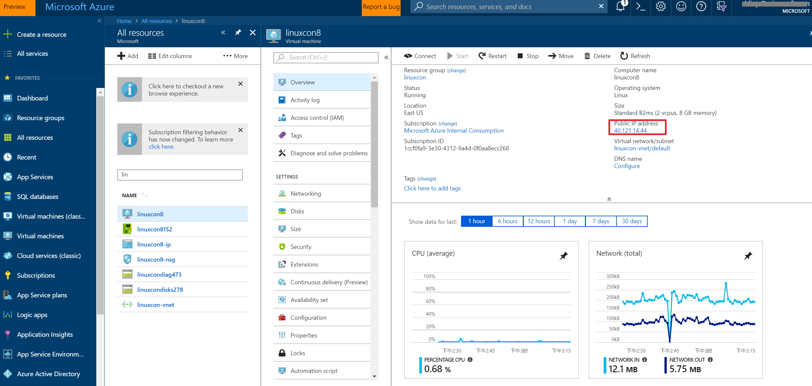

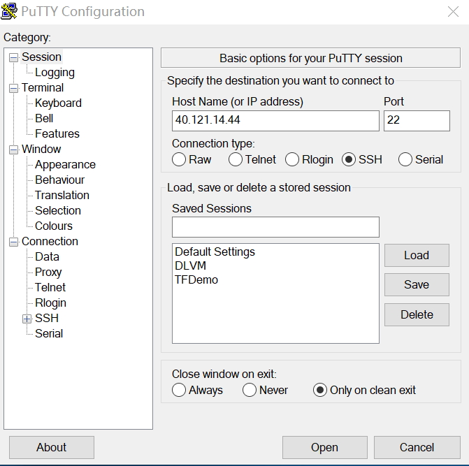

After login to the Linux VM, input the below command to download the model and create docker image. Finally, you can see the docker image named model-img.

``` Linux command
wget "<custom vision model download url>" -k -O cv.zip
```
You can also download the model we provide [here](http://aka.ms/linuxcon8-model)
Execute the following commands, to create the model.
```
unzip cv.zip -d cv
mv DockerFile Dockerfile
sudo docker build -t model-img .
```
check the docekr image：
```
lincon@linuxcon8:~$ sudo docker images
REPOSITORY                          TAG                 IMAGE ID            CREATED             SIZE
model-img                           latest              df7246f8785b        11 minutes ago      1.33 GB
...
```

Start the Docker image, and test it: upload the image url and get the classification result.
``` Linux command
sudo docker run -p 80:80 -d model-img
curl -X POST http://127.0.0.1:80/url -d "{ \"url\": \"https://icdn2.digitaltrends.com/image/chimera-majestic-sheep-tongue.jpg\" }"
```
You'll get the result like below：
```
{
  "created": "2018-06-21T15:42:48.185278",
  "id": "",
  "iteration": "",
  "predictions": [
    {
      "boundingBox": null,
      "probability": 0.999999463558197,
      "tagId": "",
      "tagName": "sheep"
    }
  ],
  "project": ""
}
```
So far, we have finished the animal image classification model. This docker image "model-img" will be the backend (azure-ai-back) of the AI application.

### Exercise 2：Front end application

First，get the code of front end: azure-ai-front
```
git clone https://github.com/MS-CSE-GCR/Linuxcon2018.git
```
Execute the command to compile and package.
```
cd Linuxcon2018
mvn package
```
azure-ai-front is a Java web application based on Spring Boot. After packaging it, we'll start creating the image.
```
sudo docker build -t app-img .
```
Execute below command, to check the image.
```
lincon@linuxcon8:~$ sudo docker images
REPOSITORY                          TAG                 IMAGE ID            CREATED             SIZE
app-img                             latest              4a9249287efb        16 hours ago        661 MB
```

### Exercise 3：Create Azure Container Registry

Azure Container Registry(ACR) is the Docker Registry on Azure，based on open source Docker Registry 2.0，for storage and management of user's private Docker image. AKS can pull the image from ACR and deploy it to container cluster.

#### 1、Config Azure Commandline

Creating and managing ACR needs Azure Commandline. Azure CLI has been installed in the VM. We should login the Aure CLI first.

``` Azure cli
az login
```
After entering the command, you 'll get the login link and authorization code. You can input the authorization code in the web page to finish the login.
```
lincon@linuxcon8:~$ az login
To sign in, use a web browser to open the page https://microsoft.com/devicelogin and enter the code AP3JJGVSK to authenticate.
```
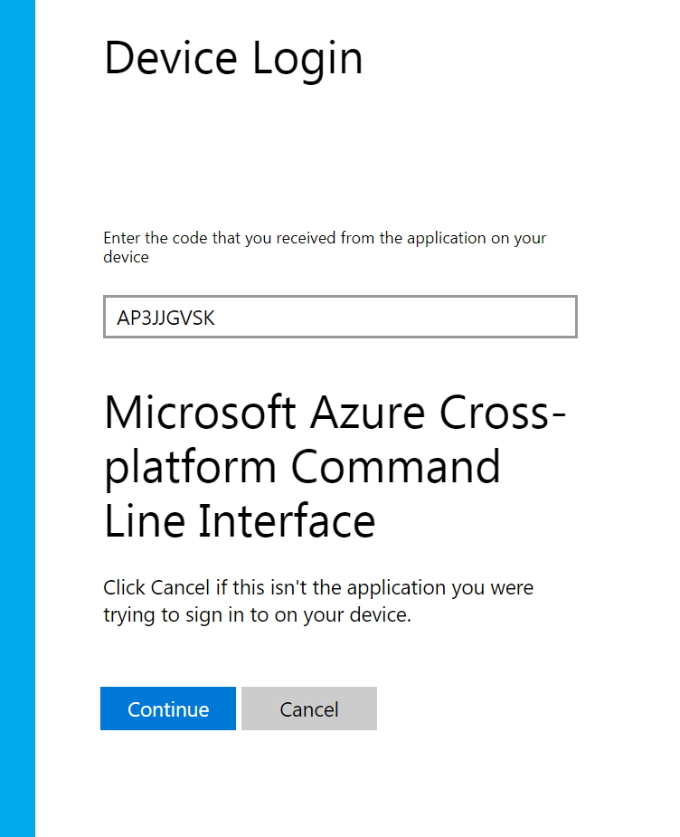

#### 2、Create Azure Container Registry

First you should get the resource group name. The ACR will be set up in this Resource Group.


Create ACR. Replace the <ResourceGroupName> with your resource group name, replace <RegistryName> with ACR name.

```Azure CLI
az acr create -g <ResourceGroupName> -n <RegistryName> --sku Basic
```
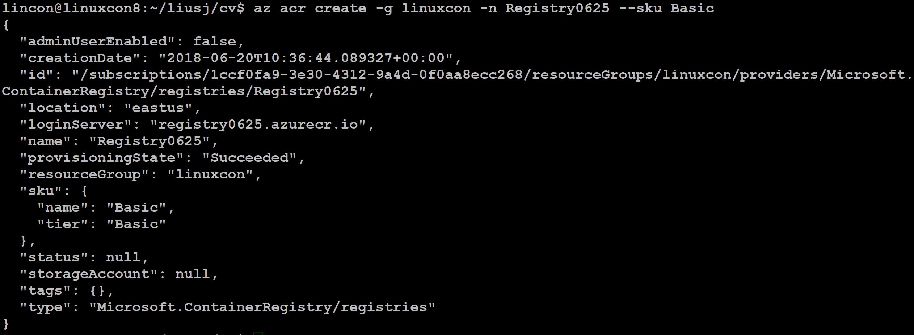

Login ACR
```Azure CLI
sudo az acr login --name <RegistryName>
```
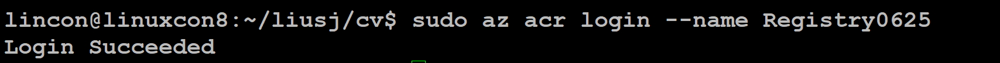


Show loginserver

```Azure CLI
az acr show --name <RegistryName> --query loginServer
```
Confirm that the format of loginServer is <RegistryName>.azurecr.io

#### 3. tag the image and push it to registry

```Azure CLI
sudo docker tag app-img <RegistryName>.azurecr.io/app-img:v1
sudo docker push <RegistryName>.azurecr.io/app-img:v1

sudo docker tag model-img <RegistryName>.azurecr.io/model-img:v1
sudo docker push <RegistryName>.azurecr.io/model-img:v1
```
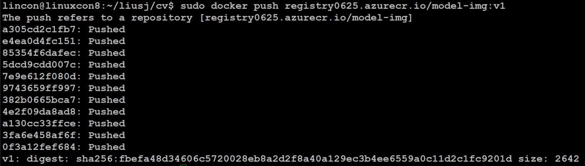

If it shows "failed: authentication required, you can execute below command to login again, and then repeat the pushing process.
```Azure CLI
sudo az acr login --name <RegistryName>
```

Return the result of ACR

```Azure CLI
az acr repository list --name <RegistryName> --output table
```
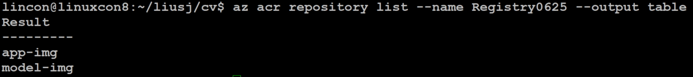

```Azure CLI
az acr repository show-tags --name <RegistryName> --repository model-img --output table
```

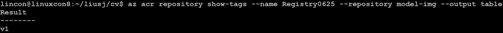

So far, the two images have been pushed to Azure Container Registry.

### Exercise 4：Create Kubernetes Cluster
Execute below command to create Kubernetes Cluster。This operation will take more than 10 minutes.
```
az aks create --resource-group <ResourceGroupName> --name <ClusterName> --node-count 1 --generate-ssh-keys
```
To use any client to connect to Kubernetes Cluster, you can just install AKS CLI, execute below command：
```
sudo az aks install-cli
```

Use kubectl to connect to Kubernetes Cluster
```
az aks get-credentials --resource-group <ResourceGroupName> --name <ClusterName>
```
Execute following command to check details of Kubernetes Cluster
```
lincon@linuxcon8:~$ kubectl get nodes
NAME                       STATUS    ROLES     AGE       VERSION
aks-nodepool1-15518157-0   Ready     agent     1d        v1.9.6
```
#### Config ACR authentication
We need config the authentication between AKS cluster and ARC registry, so that AKS identity can have access to pulling images from ACR registry。 
Step 1, get service principal ID of AKS
```
az aks show --resource-group <ResourceGroupName> --name <ClusterName> --query "servicePrincipalProfile.clientId" --output tsv
```
Step 2, get ACR registry resource id
```
az acr show --name <RegistryName> --resource-group <ResourceGroupName> --query "id" --output tsv
```
Step3, create role assignment, to config authentication
```
az role assignment create --assignee <clientID> --role Reader --scope <acrID>
```

### Exercise 5：Deploy and manage AKS cluster
Update manifest file：azure-ai.yaml (You can find in the folder of Linuxcon2018 (git clone https://github.com/MS-CSE-GCR/Linuxcon2018.git)).
Azure Container Registry (ACR) is used to store container image. Before running the application, we need use name of ACR login server to update the Kubernetes manifest file, and the azure-ai.yaml file.
```
az acr list --resource-group <ResourceGroupName> --query "[].{acrLoginServer:loginServer}" --output table
```

Update azure-ai.yaml as below
```
 ...
 containers:
      - name: azure-ai-back
        image: <RegistryName>.azurecr.io/model-img:v1
 ...
 containers:
      - name: azure-ai-front
        image: <RegistryName>.azurecr.io/app-img:v1
...
```
Run the command to deploy application:
```
kubectl apply -f azure-ai.yaml
```
Result is as below:
```
deployment "azure-ai-back" created
service "azure-ai-back" created
deployment "azure-ai-front" created
service "azure-ai-front" created
```
Test AI application

Kubernetes Service takes several minutes to expose the application to Internet.We can use below command to monitor the process:
```
lincon@linuxcon8:~$ kubectl get service azure-ai-front --watch
NAME             TYPE           CLUSTER-IP     EXTERNAL-IP      PORT(S)          AGE
azure-ai-front   LoadBalancer   10.0.243.231   40.114.107.184   8080:30848/TCP   1d
```

After we get EXTERNAL-IP, you can visit the app with below url:
http://EXTERNAL-IP:8080

The web page is as below:

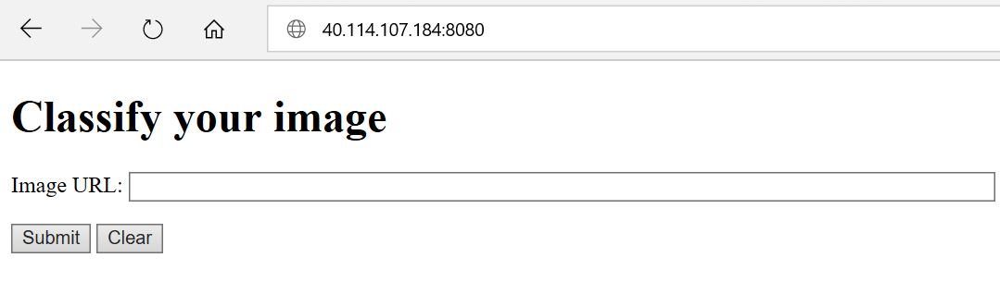

In the box of Image URL, copy the image url and submit:
```
http://www.parishplan.uk/wp-content/uploads/2015/05/Sheep-300.jpg
http://cf.ltkcdn.net/kids/images/slide/91879-445x400-animalfact8.jpg
```
The result is like this:
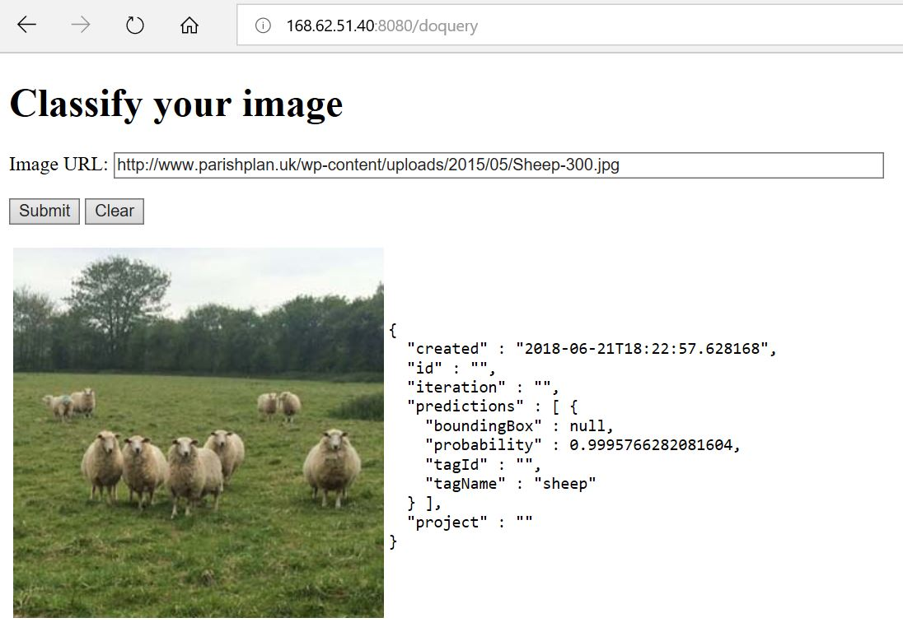

You can use other online images to test the app. The azure-ai-front accepts your request, the image will be sent to azure-ai-back for image classification, the result will be sent back to azure-ai-front in json.

### Exercise 6：Scale AI application
We have finished the deployment of AI application on AKS, now we'll start to learn how to scale.

#### 1、Scale AKS Nodes
The Kubernetes Cluster we created only has one node. To make the AI application afford more workload, we need scale the number of node.

Now, we'll scale the number of node to 3. It'll take several minutes.

```
az aks scale --resource-group=<ResourceGroupName> --name=<ClusterName> --node-count 3
```
Check number of node:
```
lincon@linuxcon8:~$ kubectl get nodes
NAME                       STATUS    ROLES     AGE       VERSION
aks-nodepool1-15518157-0   Ready     agent     1d        v1.9.6
aks-nodepool1-15518157-1   Ready     agent     6h        v1.9.6
aks-nodepool1-15518157-2   Ready     agent     6h        v1.9.6
```
#### 2、Manually scale pods

Each instance of the azure-ai-front and azure-ai-back we deployed has a replica. Run the command:

```
lincon@linuxcon8:~$ kubectl get pods
NAME                              READY     STATUS    RESTARTS   AGE
azure-ai-back-559b7cc9b4-566p2    1/1       Running   0          1d
azure-ai-front-565b88ccd8-45h4j   1/1       Running   0          6h
```

We'll manually scale the number of replica to 5.

```
kubectl scale --replicas=5 deployment/azure-ai-front
```
Run the command to check the result:
```
lincon@linuxcon8:~$ kubectl get pods
NAME                              READY     STATUS    RESTARTS   AGE
azure-ai-back-559b7cc9b4-566p2    1/1       Running   0          1d
azure-ai-front-565b88ccd8-45h4j   1/1       Running   0          6h
azure-ai-front-565b88ccd8-hc74s   1/1       Running   0          6h
azure-ai-front-565b88ccd8-mrh6c   1/1       Running   0          6h
azure-ai-front-565b88ccd8-x575h   1/1       Running   0          6h
azure-ai-front-565b88ccd8-zlhzr   1/1       Running   0          16h
```
#### 3、Autoscale pods
Kubernetes support horizontal pod autoscaling，that means it can scale the number of pod according to CPU utilization rate or other rules.
To use autoscaler, we must define CPU requests and limits. for example, in azure-ai-front deployment, we define container requests 0.25 CPU and limit is 0.5 CPU:

```
resources:
  requests:
     cpu: 250m
  limits:
     cpu: 500m
```
Now we'll use kubectl autoscale command to autoscale number of pod: if the utilization rate of CPU is beyond 50%, autoscaler will increase the number of pod to 10.

```
kubectl autoscale deployment azure-ai-front --cpu-percent=50 --min=3 --max=10
```
Check status of autoscaler:
```
lincon@linuxcon8:~$ kubectl get hpa
NAME             REFERENCE                   TARGETS         MINPODS   MAXPODS   REPLICAS   AGE
azure-ai-front   Deployment/azure-ai-front   <unknown>/50%   3         10        5          6h
```
### Summary
Congratulations! You have finished the experiment! In this HOL, you learned how to use Azure Custom Vision service to train the model of image classification, and deploy the model and a front end application to Azure Container Service(AKS), and how to scale the cluster.

### Reference
* [Azure Container Service(AKS)](https://docs.microsoft.com/en-us/azure/aks/)
* [Microsoft Azure AI](http://www.azure.com/ai)